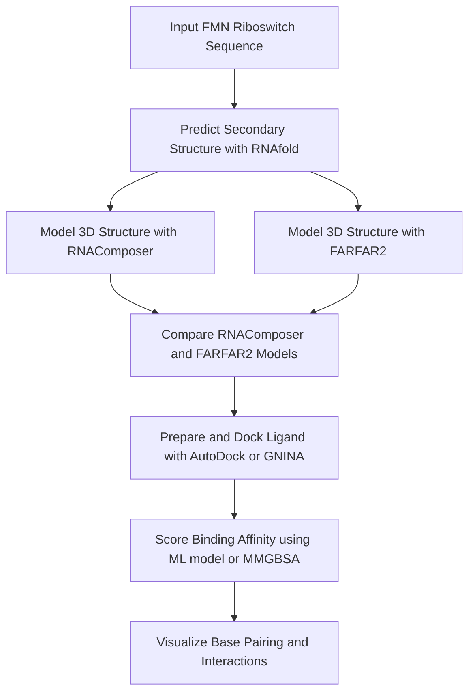

# AI-Guided RNA Structure & Ligand Binding Prediction

**Author:** Iker Zapirain Gysling  
**Project Type:** Cheminformatics + Machine Learning + Drug Discovery
**Status:** 🚧 In Progress  

## Project Overview

This project explores the application of **bioinformatics, structural modeling**, and **AI/ML-based scoring** to predict and evaluate **RNA-ligand interactions**. It focuses on **xRNA therapeutics** and aims to demonstrate a modular pipeline integrating sequence-to-structure prediction, small molecule docking, and machine learning–driven affinity scoring.

This repository is part of a broader portfolio focused on **computational biochemistry and molecular design** using modern AI tools.

---

## Objectives

Given a therapeutic or regulatory **RNA sequence**, the objective is to:

- Predict its **secondary and tertiary structure**
- Model its **3D fold and functional conformation**
- Dock a **known small molecule ligand**
- Score and evaluate **binding affinity and interaction quality**
- Visualize **base-pairing patterns and ligand contacts**

---

## 🛠️ Tools & Frameworks

| Step                       | Tools Used                                           |
|----------------------------|------------------------------------------------------|
| Secondary Structure        | ViennaRNA (RNAfold)                                  |
| Tertiary Structure         | FARFAR2 (Rosetta), RNAComposer                       |
| Ligand Docking             | AutoDock Vina, GNINA (DL-based docking)              |
| Affinity Scoring           | GraphBind, DeepBindRNA, MM/GBSA                     |
| Visualization              | PyMOL, NGL Viewer, VARNA                            |

---

## Target RNA Structure

- **Target:** FMN riboswitch (Flavin mononucleotide riboswitch)  
- **Rfam ID:** [RF00050](https://rfam.org/family/RF00050)  
- **Source Organism:** *Bacillus subtilis*  
- **Sequence Source:** Extracted from experimentally solved structure [PDB: 3F2Q](https://www.rcsb.org/structure/3F2Q)  
- **Why this target?** The FMN riboswitch is a highly conserved non-coding RNA element that regulates gene expression in response to binding flavin mononucleotide (FMN). It is extensively studied, with multiple high-resolution 3D structures available and a well-characterized ligand binding pocket. Its biological relevance, small size, and structural data make it an ideal candidate for benchmarking RNA-ligand docking and ML-based affinity prediction pipelines.

---

## Workflow Summary



---

## Repository Structure

```text
rna_ligand_binding_ai/
│
├── README.md                       ← Project overview and workflow description
│
├── data/                           ← RNA sequences, ligands, and structural sources
│   ├── fmn_riboswitch.fasta        ← Target RNA sequence
│   ├── ligands.sdf                 ← Known small-molecule ligands (e.g., FMN)
│   └── pdb_refs.txt                ← Referenced PDB entries (e.g., 3F2Q, 2YIF)
│
├── secondary/                      ← Secondary structure predictions
│   ├── fmn_riboswitch_ss.dot       ← RNAfold output (dot-bracket)
│   └── fmn_riboswitch_ss.png       ← VARNA secondary structure diagram
│
├── tertiary/                       ← 3D RNA models (FARFAR2, EternaFold)
│   ├── fmn_riboswitch.pdb          ← Predicted tertiary structure
│   └── structure.log               ← Modeling log/output
│
├── docking/                        ← Docking configs and results (GNINA, AutoDock)
│   ├── receptor.pdbqt              ← RNA receptor prepared for docking
│   ├── ligand.pdbqt                ← Ligand prepared for docking
│   └── docking_results.sdf         ← Docked poses and scores
│
├── scoring/                        ← Binding affinity scoring outputs
│   ├── graphbind_score.json        ← ML-based scoring results
│   └── mmgbsa_results.csv          ← Physics-based energy estimates
│
├── visualization/                  ← Structural visualizations and diagrams
│   ├── pymol_session.pse           ← PyMOL session highlighting binding site
│   ├── ngl_viewer_script.js        ← NGL visual config
│   └── basepair_contacts.png       ← Diagram of base-ligand interactions
│
├── notebooks/                      ← Jupyter notebooks for each pipeline stage
│   ├── 01_secondary_structure.ipynb← Secondary structure prediction
│   ├── 02_tertiary_modeling.ipynb  ← 3D structure generation
│   ├── 03_docking.ipynb            ← Ligand docking and analysis
│   └── 04_scoring_visualization.ipynb ← Affinity scoring and visualization
│
└── scripts/                        ← Helper scripts for preprocessing, scoring, etc.
```

---

## Key Analyses

- **Secondary structure prediction and base-pairing patterns**
- **RNA 3D model comparison** using different tools (FARFAR2, RNAComposer)
- **Docking score distribution** across ligand poses (GNINA/AutoDock)
- **AI-based vs. physics-based scoring performance**
- **Interaction visualization**: hydrogen bonds, stacking, and contacts

---

## Future Improvements

- Add support for additional RNA targets (e.g., SAM riboswitch, aptamers)
- Integrate experimental constraints (e.g., SHAPE, ICshape) into modeling
- Compare performance of different scoring models (GraphBind, DeepBindRNA)
- Extend pipeline to virtual screening of RNA-targeted ligand libraries
- Package as a command-line tool or Streamlit app for interactive use

---

## Learning Outcomes

Understand the RNA-ligand binding prediction pipeline  
Use RNA-specific tools for structure modeling and docking  
Apply AI/ML models for binding affinity scoring  
Visualize molecular interactions at RNA binding sites  
Maintain modular, clean, and reproducible bioinformatics projects

---

## License and Citation

This project is for academic and portfolio purposes.  

RNAComposer:
- Sarzynska, J., Popenda, M., Antczak, M., Szachniuk, M. RNA tertiary structure prediction using RNAComposer in CASP15, PROTEINS: Structure, Function, and Bioinformatics, 2023, 91(12):1790-1799 (doi: 10.1002/prot.26578).
- Popenda, M., Szachniuk, M., Antczak, M., Purzycka, K.J., Lukasiak, P., Bartol, N., Blazewicz, J., Adamiak, R.W. Automated 3D structure composition for large RNAs, Nucleic Acids Research, 2012, 40(14):e112 (doi:10.1093/nar/gks339).

FARFAR2:
- Watkins, A. M.; Rangan, R.; Das, R. “FARFAR2: Improved de novo Rosetta prediction of complex global RNA folds.” Structure, 2020, 28: 963-976.; doi: https://doi.org/10.1016/j.str.2020.05.011
- Watkins, A. M.; Das, R. "RNA 3D modeling with FARFAR2, online." bioRxiv 2020.11.26.399451; doi: https://doi.org/10.1101/2020.11.26.399451
- Lyskov S, Chou FC, Conchúir SÓ, Der BS, Drew K, Kuroda D, Xu J, Weitzner BD, Renfrew PD, Sripakdeevong P, Borgo B, Havranek JJ, Kuhlman B, Kortemme T, Bonneau R, Gray JJ, Das R., "Serverification of Molecular Modeling Applications: The Rosetta Online Server That Includes Everyone (ROSIE)". PLoS One. 2013 May 22;8(5):e63906. doi: 10.1371/journal.pone.0063906. Print 2013.

---
